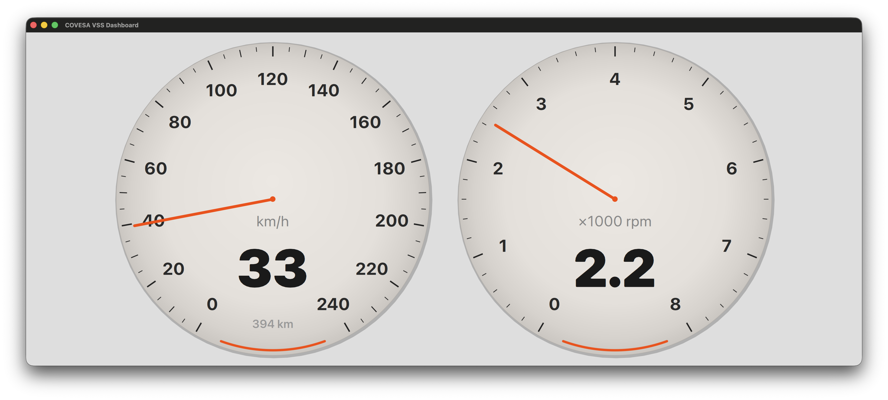

# COVESA VSS Qt Library

A Qt library wrapping the COVESA Vehicle Signal Specification (VSS) v6.0 as native Qt/QML types. Built with Qt Interface Framework and ifcodegen for automatic code generation from QFace IDL files.



## Overview

This library provides 600+ vehicle data signals organized into 12 QML modules, each mapping to a VSS domain. Every signal is exposed as a `Q_PROPERTY` on a QObject-derived class, usable directly from both C++ and QML. A built-in KUKSA Databroker backend plugin connects to [Eclipse KUKSA](https://github.com/eclipse-kuksa/kuksa-databroker) via gRPC to provide live vehicle data.

## Requirements

- **Qt 6.10+** with the following modules:
  - Qt Core
  - Qt Interface Framework
  - Qt Qml
  - Qt Quick
  - Qt Protobuf + Qt Grpc (optional, for KUKSA backend plugin)
- CMake 3.16+
- C++17 compiler

## Getting Started

### Clone

```sh
git clone <repository-url> covesavss
cd covesavss
```

### Build

Use `qt-cmake` from your Qt installation to configure and build:

```sh
# macOS
/path/to/Qt/6.10.2/macos/bin/qt-cmake -S . -B build

# Linux
/path/to/Qt/6.10.2/gcc_64/bin/qt-cmake -S . -B build

# Windows (from a Qt command prompt)
C:\Qt\6.10.2\msvc2022_64\bin\qt-cmake -S . -B build
```

Then build:

```sh
cmake --build build
```

### Run Tests

```sh
qt-cmake -S . -B build -DBUILD_TESTING=ON
cmake --build build
cd build && ctest --output-on-failure
```

## Using in Your Qt Application

### CMake Integration

The recommended way to consume this library is via `add_subdirectory`. In your project's `CMakeLists.txt`:

```cmake
cmake_minimum_required(VERSION 3.16)
project(myapp LANGUAGES CXX)

find_package(Qt6 REQUIRED COMPONENTS Core Qml Quick InterfaceFramework)
qt_standard_project_setup(REQUIRES 6.10)

# Add the COVESA VSS library (adjust path to where you cloned it)
add_subdirectory(third_party/covesavss)

qt_add_executable(myapp main.cpp)
qt_add_qml_module(myapp URI MyApp QML_FILES Main.qml)

# Link the frontend libraries for the modules you need
target_link_libraries(myapp PRIVATE
    covesavss_vehicle_frontend
    covesavss_powertrain_frontend
    covesavss_cabin_frontend
    Qt::Quick
)
```

Each domain module produces a frontend target named `covesavss_<module>_frontend`:

| Module | CMake Target |
|---|---|
| Vehicle | `covesavss_vehicle_frontend` |
| Powertrain | `covesavss_powertrain_frontend` |
| Body | `covesavss_body_frontend` |
| Cabin | `covesavss_cabin_frontend` |
| ADAS | `covesavss_adas_frontend` |
| Chassis | `covesavss_chassis_frontend` |
| Driver | `covesavss_driver_frontend` |
| Safety | `covesavss_safety_frontend` |
| Exterior | `covesavss_exterior_frontend` |
| Service | `covesavss_service_frontend` |
| Connectivity | `covesavss_connectivity_frontend` |
| MotionManagement | `covesavss_motionmanagement_frontend` |

The shared `covesavss_common` library (enums) is linked automatically via each frontend's `PUBLIC` dependency.

### KUKSA Databroker Backend

The library includes a backend plugin (`src/plugins/kuksa/`) that connects to [Eclipse KUKSA Databroker](https://github.com/eclipse-kuksa/kuksa-databroker) via gRPC. It is built automatically when Qt Protobuf and Qt Grpc modules are available.

**Quick start with the mock databroker:**

A self-contained mock databroker is included at `examples/kuksa-mock.py`. It acts as a gRPC server implementing the KUKSA VAL v2 API, so no Docker or real databroker is needed:

```sh
# Install Python dependencies (one time)
pip install grpcio grpcio-tools

# Start the mock databroker
python examples/kuksa-mock.py &

# Run the dashboard
KUKSA_HOST=localhost KUKSA_PORT=55555 build/examples/dashboard/vss_dashboard
```

The mock server compiles the vendored proto files at startup and streams animated values for Vehicle.Speed, CombustionEngine.Speed, and FuelSystem.Range.

**Running with a real KUKSA Databroker:**

```sh
docker run --rm -d -p 55555:55555 \
  ghcr.io/eclipse-kuksa/kuksa-databroker:main --insecure

KUKSA_HOST=localhost KUKSA_PORT=55555 build/examples/dashboard/vss_dashboard
```

**Configuration:** The plugin reads `KUKSA_HOST` and `KUKSA_PORT` environment variables. It can also be configured at runtime via `updateServiceSettings({"host": "...", "port": ...})` through the Qt Interface Framework service settings system.

**Plugin discovery:** The build places the plugin at `build/plugins/interfaceframework/`, and the dashboard example automatically adds this to the library path. For other applications, add `build/plugins` to `QT_PLUGIN_PATH` or call `QCoreApplication::addLibraryPath()`.

### Custom Backends

You can also implement your own Qt IF backend plugin that connects to a different data source (CAN bus, SOME/IP, etc.). The generated backend interface headers in the build directory define the contract each backend must implement.

### QML Usage

Import the modules you need and instantiate interface types:

```qml
import QtQuick
import QtQuick.Controls
import COVESA.VSS.Vehicle
import COVESA.VSS.Powertrain

ApplicationWindow {
    VehicleDynamics { id: dynamics }
    TractionBattery { id: battery }

    Text {
        text: "Speed: " + dynamics.speed.toFixed(1) + " km/h"
    }
    Text {
        text: "Battery: " + battery.stateOfCharge.toFixed(0) + "%"
    }
}
```

Zoned interfaces support Qt Interface Framework's zone model for multi-instance VSS branches (seats, wheels, doors):

```qml
import COVESA.VSS.Cabin

CabinHVAC {
    id: hvac
    zone: "FrontLeft"
}
Text { text: "Driver temp: " + hvac.targetTemperature }
```

### C++ Usage

The generated headers follow the pattern `<lowercaseinterfacename>.h`. Include them and use the types directly:

```cpp
#include <vehicledynamics.h>
#include <tractionbattery.h>

auto *dynamics = new VehicleDynamics(this);
qDebug() << "Speed:" << dynamics->speed();

auto *battery = new TractionBattery(this);
qDebug() << "SoC:" << battery->stateOfCharge();
```

Common enums are on the generated `Common` class:

```cpp
#include <common.h>

// Enum values use type-specific prefixes to avoid collisions
Common::PowertrainElectric  // PowertrainType enum
Common::FuelGasoline        // FuelType enum
Common::ChargeActive        // ChargingStatus enum
```

## QML Modules

| QML Import URI | VSS Domain | Interfaces |
|---|---|---|
| `COVESA.VSS.Vehicle` | Top-level vehicle signals | VehicleIdentification, VehicleDynamics, CurrentLocation, LowVoltageBattery |
| `COVESA.VSS.Powertrain` | Powertrain subsystems | PowertrainStatus, CombustionEngine, Transmission, ElectricMotor (zoned), TractionBattery, FuelSystem |
| `COVESA.VSS.Body` | Body, lights, mirrors | BodyControl, BodyLights, Windshield (zoned), BodyMirrors (zoned) |
| `COVESA.VSS.Cabin` | Seats, HVAC, infotainment | CabinSeat (zoned), CabinHVAC (zoned), CabinInfotainment, CabinDoor (zoned), CabinLights |
| `COVESA.VSS.ADAS` | Driver assist systems | ADASControl, CruiseControl, ObstacleDetection (zoned) |
| `COVESA.VSS.Chassis` | Steering, brakes, wheels | ChassisAxle (zoned), ChassisWheel (zoned), ChassisSteering, ChassisBrake |
| `COVESA.VSS.Driver` | Driver monitoring | DriverMonitoring |
| `COVESA.VSS.Safety` | Crash detection | CrashDetection, AirbagSystem (zoned), BeltSystem (zoned) |
| `COVESA.VSS.Exterior` | Environment sensors | EnvironmentSensors |
| `COVESA.VSS.Service` | Service status | ServiceStatus |
| `COVESA.VSS.Connectivity` | Connectivity status | ConnectivityControl |
| `COVESA.VSS.MotionManagement` | Brake/steering/suspension control | BrakeControl, SteeringControl, SuspensionControl (zoned) |

Shared enums are in the `Common` module, imported automatically by all domain modules.

## Architecture

```
┌─────────────────────────────────────────────────────────────────┐
│                        QML / C++ Application                    │
│                                                                 │
│   import COVESA.VSS.Vehicle    import COVESA.VSS.Powertrain     │
│   VehicleDynamics { }          TractionBattery { }              │
└──────────┬──────────────────────────────┬───────────────────────┘
           │ links                        │ links
           v                              v
┌─────────────────────────────────────────────────────────────────┐
│                     Frontend Libraries                          │
│                                                                 │
│  covesavss_vehicle_frontend    covesavss_powertrain_frontend    │
│  covesavss_body_frontend       covesavss_cabin_frontend         │
│  covesavss_adas_frontend       covesavss_chassis_frontend       │
│  covesavss_driver_frontend     covesavss_safety_frontend        │
│  covesavss_exterior_frontend   covesavss_service_frontend       │
│  covesavss_connectivity_frontend                                │
│  covesavss_motionmanagement_frontend                            │
│                                                                 │
│  Auto-generated from QFace IDL via ifcodegen.                   │
│  Each produces QObject classes + QML module.                    │
│  All link PUBLIC against covesavss_common (shared enums).       │
└──────────┬──────────────────────────────────────────────────────┘
           │ Qt Interface Framework
           │ runtime plugin discovery
           v
┌─────────────────────────────────────────────────────────────────┐
│                     Backend Plugins                             │
│                     (src/plugins/)                              │
│                                                                 │
│  ┌─────────────────────────────────────────────────────────┐    │
│  │  KUKSA Backend (src/plugins/kuksa/)                     │    │
│  │                                                         │    │
│  │  KuksaPlugin ──> KuksaClient ──> gRPC ──> KUKSA         │    │
│  │       │              │            Databroker            │    │
│  │       │              v                                  │    │
│  │       │        VssPathMapping                           │    │
│  │       │        (IID,prop,zone) <-> VSS path             │    │
│  │       v                                                 │    │
│  │  36 Backend classes                                     │    │
│  │  (24 non-zoned + 12 zoned)                              │    │
│  │  Emit typed signals on property changes                 │    │
│  └─────────────────────────────────────────────────────────┘    │
│                                                                 │
│  ┌─────────────────────────────────────────────────────────┐    │
│  │  Your Backend (src/plugins/yourbackend/)                │    │
│  │  CAN bus, SOME/IP, simulation, replay, ...              │    │
│  └─────────────────────────────────────────────────────────┘    │
└─────────────────────────────────────────────────────────────────┘
```

The frontend libraries have **no dependency** on any backend. They define the Q_PROPERTY interfaces and QML types. Backend plugins are discovered at runtime by Qt Interface Framework's service manager and provide live data by implementing the generated `*BackendInterface` classes.

Each module consists of:

- **QFace IDL file** (`idl/<module>.qface`) defining interfaces, properties, and type references
- **Frontend library** (auto-generated C++ classes + QML module via `qt_ifcodegen_add_qml_module`)

The `Common` module (`idl/common.qface`) defines shared enums used across all domains. Enum values use type-specific prefixes (e.g., `PowertrainElectric`, `FuelGasoline`) to avoid collisions within the generated QObject class.

## VSS-to-QFace Mapping

| VSS Concept | QFace Representation |
|---|---|
| `sensor` (read-only data) | `readonly` property |
| `actuator` (read-write control) | Property without `readonly` |
| `attribute` (static metadata) | `readonly` property |
| `allowed` values | `Common.<EnumType>` property type |
| `instances` (Row1/Row2, Left/Right) | `@config: { zoned: true }` interface annotation |

## Project Structure

```
idl/                    QFace IDL files (source of truth)
src/common/             Shared enum library (covesavss_common)
src/<module>/           Per-module frontend library (12 modules)
src/plugins/kuksa/      KUKSA Databroker backend plugin (gRPC, optional)
tests/                  Auto-generated test suites per module + backend tests
examples/               Dashboard example app + KUKSA mock config
```

## Known Limitations

- **No install target:** The project does not provide `cmake --install` support. Use `add_subdirectory` for integration.
- **KUKSA backend requires Qt Grpc:** The backend plugin is only built when `Qt6::Protobuf` and `Qt6::Grpc` modules are found. Without them, only frontend types are available and you must provide your own backend.
- **No TLS support yet:** The KUKSA backend connects via plaintext HTTP/2. Production deployments using TLS require passing `QGrpcChannelOptions` with certificates.

## License

This project is provided as a reference implementation for the COVESA VSS specification with Qt Interface Framework.
